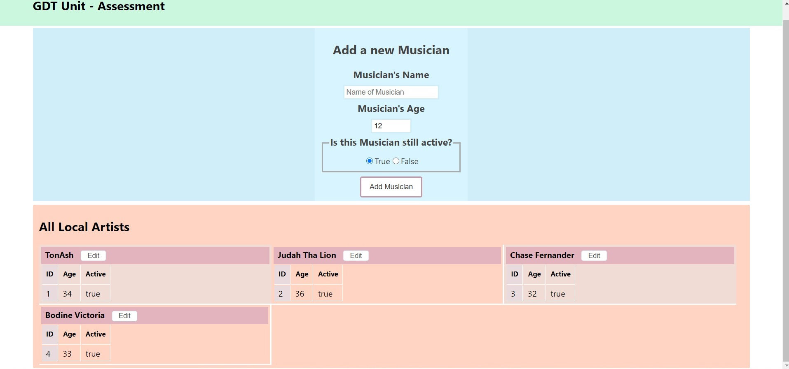

# REACT-GDT-FrontEnd
### Version 1.0
The Front-end for the Government Digital Transformation Assessment web-app that connects with a RESTful API through HTTP Requests

Web-based Application using a [custom built API](https://github.com/Aaron-RN/ROR-GDT-Assessment) to gather and manipulate information related to various musicians.

## Features
### Add a Musician
- Can add a new local Musician via a web-interface
### Edit and Update a Musician
- Can edit and update a musician that has already been added to the database via a web-interface
### View all Musicians
- Shows all musicians currently added into the database



## [Live Link](https://arn-gdt-assessment.netlify.app/)

## Built With

- HTML, CSS
- JavaScript
- React.js
- NPM Webpack

## Setup for Local use

### Clone Repository

Grab a clone of [this repository](https://github.com/Aaron-RN/REACT-GDT-FrontEnd/tree/v1.0) from Github

### [Setting up Back-End](https://github.com/Aaron-RN/ROR-GDT-Assessment)

In order for this application to work you will also need to setup your back-end server. You can do so following this readme guide [here](https://github.com/Aaron-RN/ROR-GDT-Assessment).

### Setting up Front-End to Back-End connection

After you have successfully setup your back-end, you will need to change the URL the front-end connects to.

1. Navigate to your local directory of this cloned repository
2. Navigate to the src/components/misc folder and open the apiRequests.js file
3. On line 3 where you would see const ```const API_URL = process.env.REACT_APP_API_URL;```, replace ```process.env.REACT_APP_API_URL;``` with the url of your back-end server that you would have setup following the ["Setting up The Back-End"](https://github.com/Aaron-RN/ROR-GDT-Assessment) Guide  
**b)** Or if you are using a hosting server with the option for environment variables as I am, you can simple place the URL of your API in an environment variables called REACT_APP_API_URL

### Install Dependencies

```
$ npm install
```

### Run Application

```
$ npm run server
```

### Running Tests

```
$ npm run test
```

## Running Linters

### ESLint
- Run `npx eslint .` on the root of your project directory.

## Author

👤 **Aaron Rory**

- Github: [@Aaron-RN](https://github.com/Aaron-RN)
- Twitter: [@ARNewbold](https://twitter.com/ARNewbold)
- Linkedin: [Aaron Newbold](https://www.linkedin.com/in/aaron-newbold-1b9233187/)

## 🤝 Contributing

Contributions, issues and feature requests are welcome!

Feel free to check the [issues page](issues/).

## Show your support

Give a ⭐️ if you like this project!

## 📝 License

This project is [MIT](lic.url) licensed.

